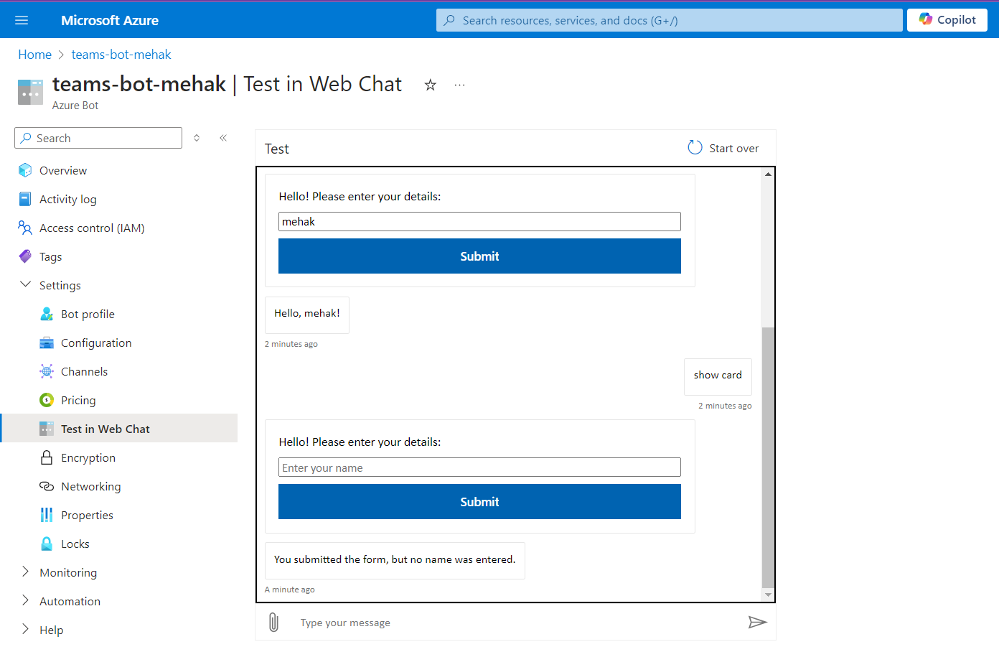
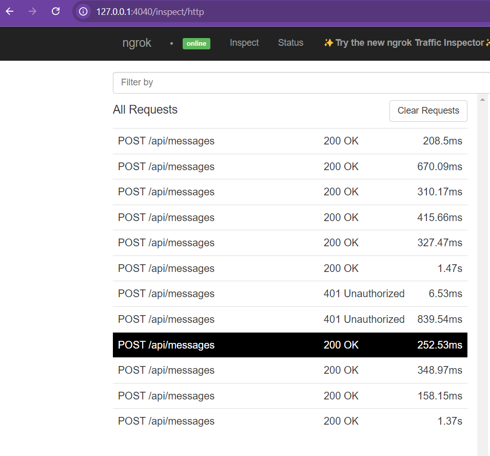

# teams-bot
I used Azure's Bot services to create a bot and integrated with adaptive cards . The code for the bot has been referred from Microsoft Teams bot code repo : https://github.com/microsoft/teams-ai . 
The Bot message endpoint in configuration section is :  ngrok URL/api/messages
The command to run ngrok is : ngrok http 3978 .
The command to run local server is : npm start .

